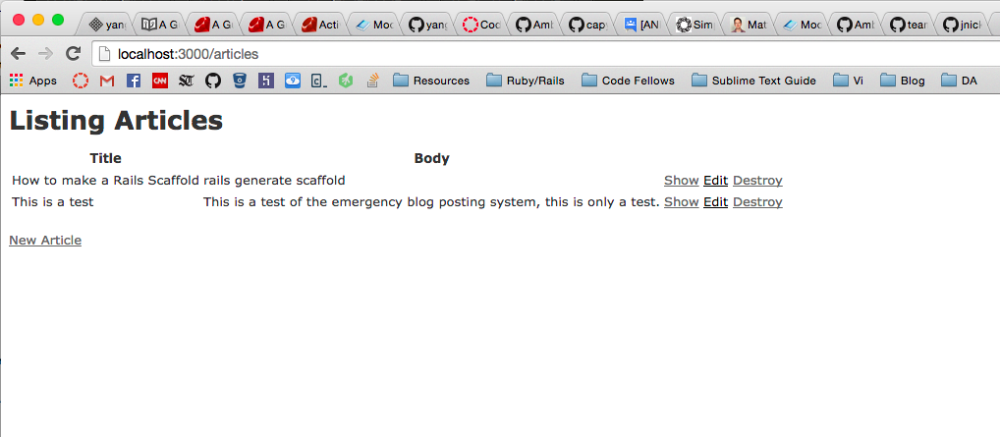

# Portfolio - Matthew G. Yang

  

By [Matthew Yang](http://www.matthewgyang.com).

## Description
**Portfolio** This is a portfolio Rails application

It includes a welcome page with links to features including the blog/journal.

## Specifications

App was created without the default test suite with this command:

```console
rails new portfolio --skip-test-unit
```

Then the following gems were added to the gem file:

```ruby
gem "minitest-rails"
```

```console
rails generate minitest:install
```

```ruby
group :test do
  gem "minitest-rails-capybara"
end
```

Then the following was added to `test/test_helper.rb`

```ruby
require "minitest/rails/capybara"
```

There is a functioning feature test suite that is currenlty passing.

## Special Notes

Continuing to add the ability to make notes by modifying Rails scaffolding, see screenshot:



There is a bug in the testing of the `#destroy` action where it seems to jump out of the test environment.  Currently it's passing by forcing the test environment with the following command:

```console
RAILS_ENV=test rake
```

## Credit
**Styling The basic HTML structure and CSS is from a Zurb Foundation template located [here](http://foundation.zurb.com/templates/portfolio-theme.html)

This gem instructions were taken directly from the following github repos:

[minitest-rails](https://github.com/blowmage/minitest-rails)

[minitest-rails-capybara](https://github.com/blowmage/minitest-rails-capybara)
